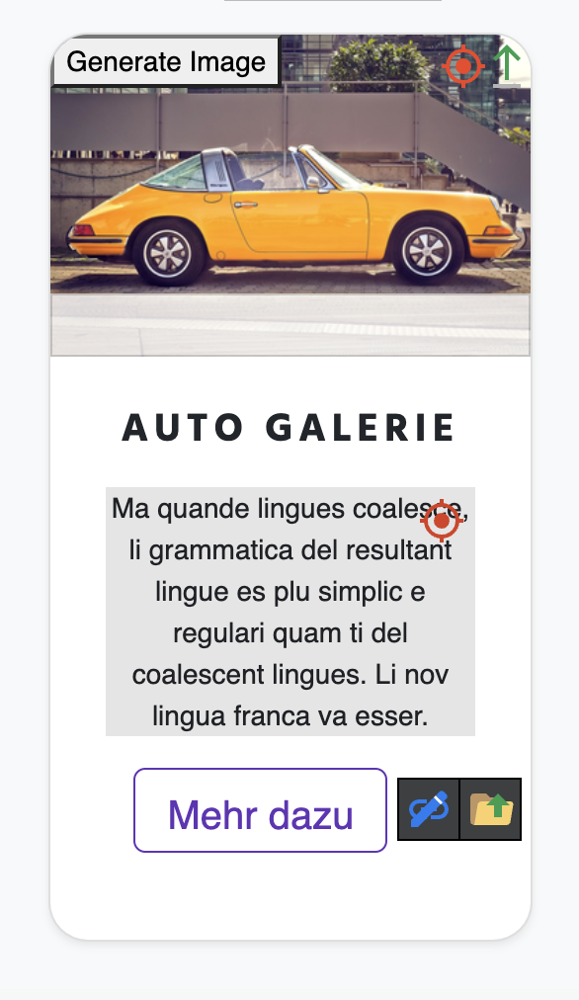
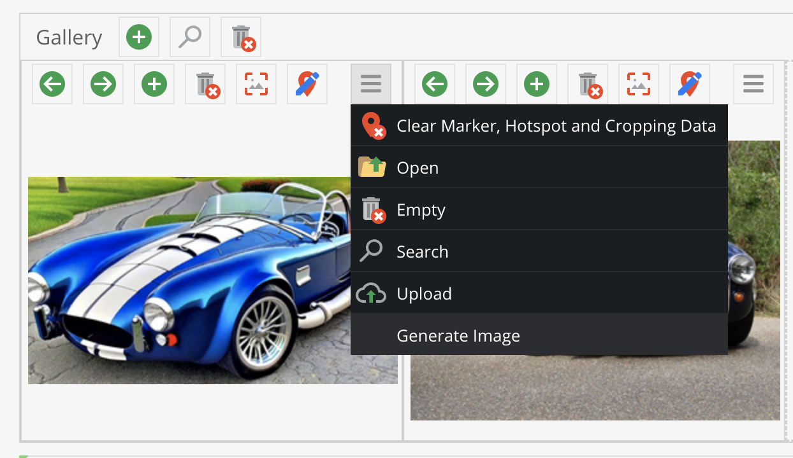

# AI Image Generator Bundle

This is currently a Proof Of Concept for Image Generation in the Pimcore Backend.
Key features will be:

* generate images in image-editables and asset-fields directly in the backend
* be able to use a local Automatic1111, DreamStudio or other APIs to generate images
* context aware image creation
    * use aspect ratio created by width and height of image-container
    * based on document/object
    * based on homepage itself
    * based on user prompts
    * configuration of context to use when generating prompts
    * (use LLMs for prompt generation)

## Installation

```
composer update basilicom/ai-image-generator-bundle
```

Make sure to also install the bundle via `BundleSetupSubscriber` or console.

## Support

| Parameter   | Text-To-Image | Variations | Upscaling | Background Inpainting |
|-------------|:-------------:|:----------:|:---------:|:---------------------:|
| ClipDrop    |       X       |     X      |     X     |           X           | 
| A1111       |       X       |     X      |     X     |           X           | 
| DreamStudio |       X       |     X      |     X     |           ~           | 
| Dall-E      |       X       |     X      |     -     |           -           | 

## Configuration

```
ai_image_generator:

  stable_diffusion_api:
    baseUrl: "http://host.docker.internal:7860" # the url to your Stable Diffusion API instance
    model: "reliberate_v10" # the model checkpoint name
    steps: 30 # this will have impact on generation-time
    upscaler: "ESRGAN_4x" # this will have impact on generation-time

  dream_studio:
    baseUrl: "https://api.stability.ai"
    model: "stable-diffusion-xl-beta-v2-2-2"
    steps: 10 
    apiKey: "%env(DREAM_STUDIO_API_KEY)%"
    upscaler: "esrgan-v1-x2plus"
    
  open_ai:
    baseUrl: "https://api.openai.com/v1"
    apiKey: "%env(OPEN_AI_API_KEY)%"
    
  clip_drop:
    baseUrl: "https://clipdrop-api.co"
    apiKey: "%env(CLIP_DROP_API_KEY)%"

```

## Usage

### Generating images in documents
If no prompt is given, the prompt will be generated (and not translated!) from 
* document SEO title
* document SEO description
* h1-Elements
* h2-Elements
* h3- and h4-elements if the previous mentioned sources are empty



### Generating images in DataObjects
If no prompt is given, the prompt will be generated (and not translated!) by trying to access the following properties:
* key
* title
* name
* productName
* description



## API

#### `(POST) /admin/ai-images/generate`

| Parameter      | Type   | Example             |
|----------------|--------|---------------------|
| **prompt**     | string | a whale             |
| negativePrompt | string | blurry, unrealistic |
| seed           | int    | -1                  |
| height         | int    | 512                 |
| width          | int    | 512                 |

#### `(POST) /admin/ai-images/generate/{context}-{id}`

| Parameter   | Type   | Example         |
|-------------|--------|-----------------|
| **context** | string | document/object |
| **id**      | int    | 123             |
| height      | int    | 512             |
| width       | int    | 512             |

#### `(POST) /admin/ai-images/upscale/{id}`

| Parameter | Type | Default | Example |
|-----------|------|---------|---------|
| **id**    | int  | 123     |         |

#### `(POST) /admin/ai-images/vary/{id}`

| Parameter | Type   | Default | Example |
|-----------|--------|---------|---------|
| **id**    | int    | 123     |         |
| prompt    | string |         | a towel |
| seed      | int    | 123     |         |

### Responses

Based on the `Accept`-header, you can say if you want to have a JSON-response or the image itself.

#### `Accept: application/json`

```
{
  success: true,
  id: Pimcore-Asset-ID,
  image: "base64-decoded Image",   
}
```

```
{
  success: false,
  message: "..."
}
```

#### `Accept: image/jpeg`

```
// the base64 decoded image
```


## Using Automatic1111's Stable Diffusion API

When running Automatic1111 locally, you can define `http://host.docker.internal:7860` as your local API-url.

Additionally, make sure you started Automatic1111 with `--api`:

```
  ./webui.sh --api # windows
  ./webui.bat --api # linux/mac
```

If you want to know which models you have, call the [Models-Endpoint](http://localhost:7860/sdapi/v1/sd-models ) and
copy the name of a model of your choice.

### Plugins used

* ControlNet with `canny` and `ip2p`
* _SD Upscaler_ Script

## Known issues

* the Dreamstudio REST API does currently not support variations, I'll look forward to use the gRPC API

### Authors

Alexander Heidrich
